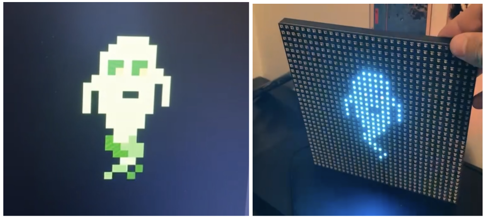

# LED-Gif-Image-Viewer
LED Gif/Image Viewer using Adafruit 32x32 LED Panel and STM32 microcontroller.

Wiring and base code taken from [this guide](https://www.instructables.com/32x32-RGB-LED-Plasma-w-STM32F4/)

Ported code from STM32F4 to STM32L476 microcontroller.

